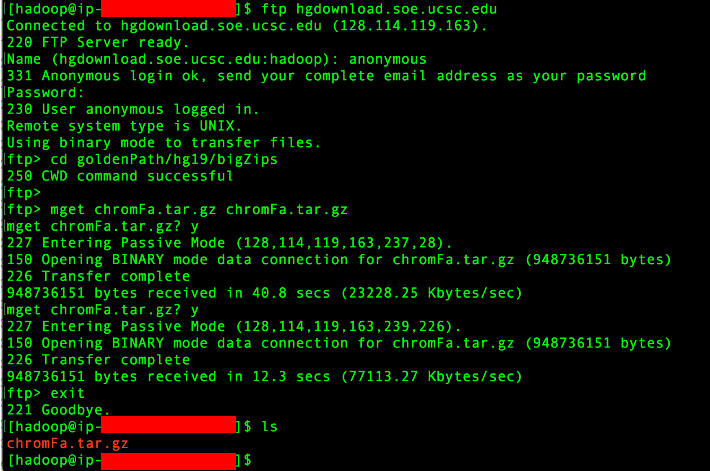

# Hadoop-CNV-RF: A Scalable Cloud-Based Copy Number Variation Detection Tool  

This is a Hadoop implementation of [CNV-RF](https://www.ncbi.nlm.nih.gov/pubmed/27597741) a 
copy number variation (CNV) detection method capableof detecting clinically relevant CNVs at scale. 
This Hadoop based implementation can rapidly scale to analyze large datasets such as whole-exome 
and whole-genome data. 

### Prerequisites
These instructions assume you have a hadoop cluster up and running with dependency software installed. If you have your own cluster, see [installing dependency software](https://github.com/getiria-onsongo/hadoop-cnvrf-public/wiki/Installing-dependency-software-for-Hadoop-CNV-RF) for instruction on how to install required software. If you are using Amazon's Elastic Map Reduce framework, we provide an image (Amazon Machine Image) with dependency software installed. See [launching hadoop on Amazon using EMR](https://github.com/getiria-onsongo/hadoop-cnvrf-public/wiki/Launching-Hadoop-on-Amazon-using-Elastic-Map-Reduce-Framework) for instructions on launching a Hadoop cluster on Amazon with dependency software installed. 


#### Prepare reference genome
If you have used BWA and Bowtie2 before and already have genome indices, create a folder in your master node and save these
indices in that folder. Compress the folder and note the location of this compressed folder. If using an EMR cluster, we recommend 
saving it in /mnt e.g.,  **/mnt/hg19/hg19_index.tar.gz**. 

If you have no experience with BWA and Bowtie2, click this link:  [Preparing Reference Genome](https://github.com/getiria-onsongo/hadoop-cnvrf-public/wiki/Preparing-Reference-Genome) for instruction on indexing the hg19 human genome for BWA and Bowtie2. 

##### Download fasta files from UCSC. 
A copy of the reference genome needs to be distributed to all cluster node. This pipeline uses BWA and Bowtie2 both of which require 
the reference genome (fasta file) to be indexed. Below are instructions for indexing a reference genome using both BWA and 
Bowtie2. We will download and index the hg19 reference genome for both BWA and Bowtie2. For convenience, both indices will be stored 
in the same folder. NOTE. The same steps can be used to index a custom reference genome. 

Since we will be using BWA and Bowtie2 to create these indices, the easiest approach is to log into your master node. It should have BWA and 
Bowtie2 installed. 

* Make sure you have ftp installed. If not, use the command below to install ftp. 

```bash
$ sudo yum install ftp -y
```

Before you download hg19, make sure you have enough space on your machine. If you used instructions in [launching hadoop on Amazon using EMR](https://github.com/getiria-onsongo/hadoop-cnvrf-public/wiki/Launching-Hadoop-on-Amazon-using-Elastic-Map-Reduce-Framework) to start
your cluster, the default user (**hadoop**) is mounted on the root volume which is 10GB and not enough disk space to index the genome. The steps
below illustrate how to switch to the mounted drive (**mnt**) with the 200GB specificied when launching the cluster. 

* Switch to the mounted EBS 
```bash
$ cd /mnt
```

* Create a directory to hold the genome files and move into that directory. 
```bash
$ mkdir hg19
$ cd hg19
```

Use the steps below to download hg19 fasta file from [UCSC](http://hgdownload.cse.ucsc.edu/downloads.html). These 
instructions have been pulled from [this link]((http://hgdownload.cse.ucsc.edu/goldenPath/hg19/bigZips/)). 

* FTP to hgdownload.soe.ucsc.edu. As of the creating of these instructions, the username is **anonymous** and the password if 
your email address. Enter the command below. You will prompted to enter a username and password. 

```bash
$ ftp hgdownload.soe.ucsc.edu
```
* Once you've successfully logged in, change directory to the one containing fasta files. 
```bash
ftp> cd goldenPath/hg19/bigZips 
```
* Get fasta files for all the chromosomes. If asked whether you want to download files, type Y and press enter. 

```bash
ftp> mget chromFa.tar.gz chromFa.tar.gz  
```

* Once the download is complete. Exit the ftp shell. 
```bash
ftp> exit
```

Below is a screenshot of a successful download. 



##### Index reference genome 
* Uncompress the fasta files. 
```bash
$ tar -zxvf chromFa.tar.gz
```

* Combine individual fasta (.fa) files into a single fasta file (hg19.fa). 
```bash
$ cat chr1.fa chr2.fa chr3.fa chr4.fa chr5.fa chr6.fa chr7.fa chr8.fa chr9.fa \
chr10.fa chr11.fa chr12.fa chr13.fa chr14.fa chr15.fa chr16.fa chr17.fa chr18.fa \
chr19.fa chr20.fa chr21.fa chr22.fa chrM.fa chrX.fa chrY.fa > hg19.fa
```

* Create a directory to hold the indices. 
```bash
$ mkdir hg19_index
```

* Move the single fasta file (hg19.fa) into the directory you just created.   
```bash
$ mv hg19.fa hg19_index
```

* Switch directories into the one containing the single fasta file.   
```bash
$ cd hg19_index
```

* Create Bowtie2 index.   **NOTE:** creating a Bowtie2 index for the whole human genome takes 
a while. About 2 hours on a machine with with 4 cores and 16GB of RAM. **Fortunately**,
we only need to do this **once**. 
```bash
$ bowtie2-build hg19.fa hg19
```

* Create BWA index. This will also take a while. About 1 hr on a machine with 4 cores 
and 16GB of RAM.  Similar to Bowtie2 index, you only need to do this once. 
```bash
$ bwa index -a bwtsw hg19.fa 
```

##### Archive index files for future usage
To avoid having to create indices everytime you use the software, follow the steps below to 
archive your indices. 

* Move one directory up and remove sequence file from index folder. 
```bash
$ cd ..
$ mv hg19_index/hg19.fa hg19.fa
```
* Compress folder containing indices

```bash
$ tar -zcvf hg19_index.tar.gz hg19_index
```
If using a cloud instance, copy the compressed folder to your local machine. You can use sftp as shown below

* Exit the SSH terminal connecting you to the cloud instance
```bash
$ exit
```

* Save a copy of the compressed folder to your local machine. Notice the dot (.) at the end. The compressed folder will 
be about 7GB in size. The transfer might take sometime depending on your internet connection. If you have a wired 
connection, it is recommended you use it instead of wireless. 

```bash
$ scp -i myPrivateKey.pem hadoop@xxx.us-west-2.compute.amazonaws.com:/mnt/hg19/hg19_index.tar.gz .
```


### Installing
Once you have a Hadoop cluster up and running with dependency software installed, get a copy of Hadoop-CNV-RF. If 
using an EMR cluster, navigate to the mounted drive first. The root drive has limited disk space. 

* SSH into your machine. 

```bash
$ ssh -i myPrivateKey.pem hadoop@xxx.us-west-2.compute.amazonaws.com 
```

* Navigate to mounted drive. 
```bash
$ cd /mnt
```

* Get a copy of Hadoop-CNV-RF. 

```bash
$ git clone https://github.com/getiria-onsongo/hadoop-cnvrf-public.git 
```

* Navigate into program folder. 

```bash
$ cd hadoop-cnvrf-public
```

* Navigate into the folder contain test data and uncompress the data. 

```bash
$ cd data/sample/
$ gunzip *.gz
$ cd ../control/
$ gunzip *.gz
```

* Navigate back to program directory. 
```bash
$ cd /mnt/hadoop-cnvrf-public/
```
* Launch the analysis. 
```bash
$ 
./run_script.sh
```

<!--
## Getting Started

These instructions will get you a copy of the project up and running on your local machine for development and testing purposes. See deployment for notes on how to deploy the project on a live system.

### Prerequisites

What things you need to install the software and how to install them

```
Give examples
```

### Installing

A step by step series of examples that tell you how to get a development env running

Say what the step will be

```
Give the example
```

And repeat

```
until finished
```

End with an example of getting some data out of the system or using it for a little demo

## Running the tests

Explain how to run the automated tests for this system

### Break down into end to end tests

Explain what these tests test and why

```
Give an example
```

### And coding style tests

Explain what these tests test and why

```
Give an example
```

## Deployment

Add additional notes about how to deploy this on a live system

## Built With

* [Dropwizard](http://www.dropwizard.io/1.0.2/docs/) - The web framework used
* [Maven](https://maven.apache.org/) - Dependency Management
* [ROME](https://rometools.github.io/rome/) - Used to generate RSS Feeds

## Contributing

Please read [CONTRIBUTING.md](https://gist.github.com/PurpleBooth/b24679402957c63ec426) for details on our code of conduct, and the process for submitting pull requests to us.

## Versioning

We use [SemVer](http://semver.org/) for versioning. For the versions available, see the [tags on this repository](https://github.com/your/project/tags). 

## Authors

* **Billie Thompson** - *Initial work* - [PurpleBooth](https://github.com/PurpleBooth)

See also the list of [contributors](https://github.com/your/project/contributors) who participated in this project.

## License

This project is licensed under the MIT License - see the [LICENSE.md](LICENSE.md) file for details

## Acknowledgments

* Hat tip to anyone whose code was used
* Inspiration
* etc

-->

## We are working on instructions for installing and testing Hadoop-CNV-RF. They should be completed in a few weeks.  
